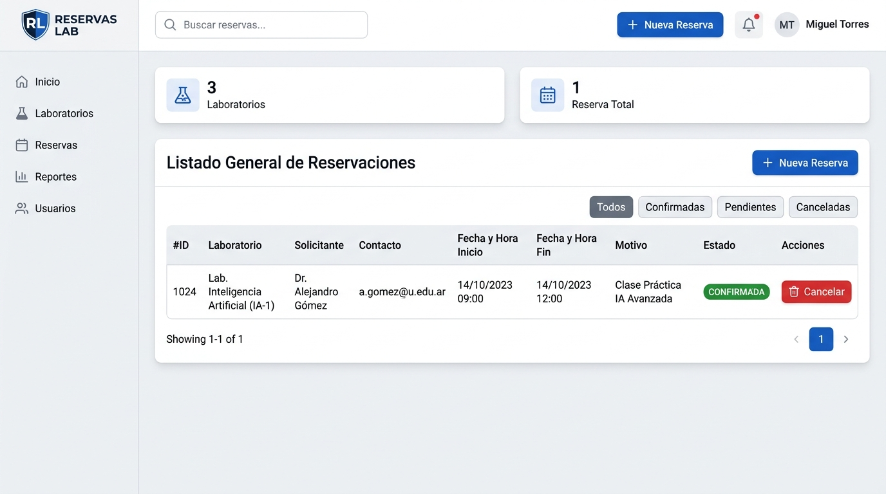
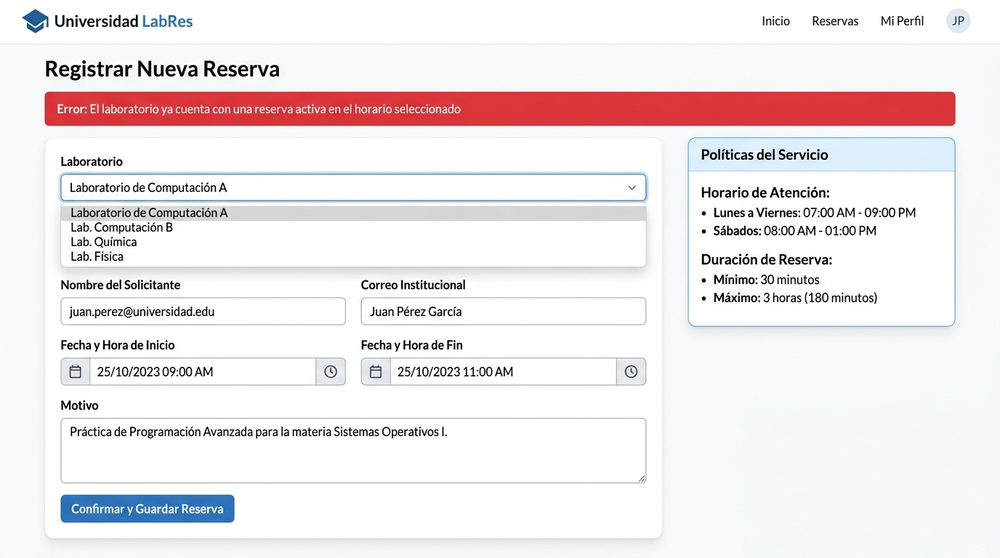
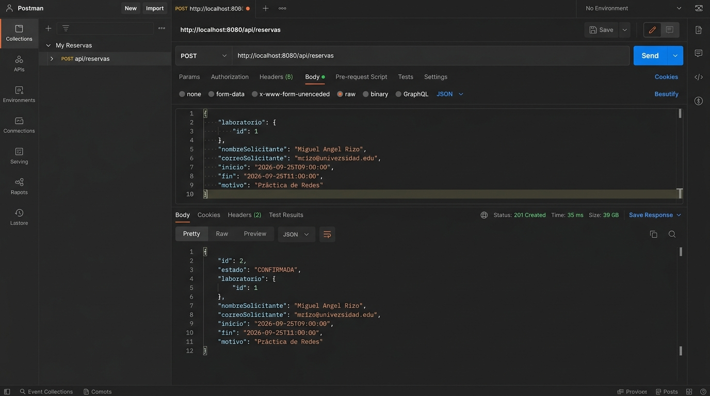
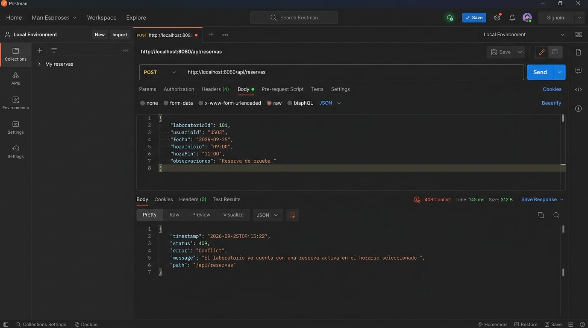

# Sistema de Reservas de Laboratorios Universitarios

**Estudiante:** Miguel Angel Rizo Arias  
**Curso / Unidad:** Post-contenido Unidad 5  
**Tecnologías:** Spring Boot 3.2.3, Java 17, Spring Data JPA, H2 Database, Thymeleaf, Lombok, JUnit 5, Mockito.

---

## 📋 Descripción del Proyecto

El **Sistema de Reservas de Laboratorios** es una solución empresarial integral diseñada bajo la arquitectura en capas y los principios de diseño de software de **Spring Boot 3.2**. Permite a la comunidad universitaria consultar el catálogo de laboratorios especializados, verificar disponibilidad horaria en tiempo real, programar reservaciones y gestionar cancelaciones controladas, tanto a través de una **Interfaz Web dinámica con Thymeleaf** como mediante una **API RESTful** para integraciones externas.

---

## 🏛️ Arquitectura del Sistema y Separación de Responsabilidades

El proyecto implementa estrictamente una arquitectura desacoplada por capas:

```
com.universidad.reservaslabs
├── ReservasLabsApplication.java          # Punto de entrada de la aplicación Spring Boot
├── config
│   └── DataInitializer.java              # Semilla de datos para pruebas (CommandLineRunner)
├── model                                 # Capa de Dominio (Entidades JPA)
│   ├── EstadoReserva.java                # Enum: PENDIENTE, CONFIRMADA, CANCELADA
│   ├── Laboratorio.java                  # Entidad de Laboratorio universitario
│   └── Reserva.java                      # Entidad de Reserva con relación @ManyToOne
├── repository                            # Capa de Acceso a Datos (Spring Data JPA)
│   ├── LaboratorioRepository.java        # Consultas de catálogo y existsByNombreIgnoreCase
│   └── ReservaRepository.java            # Consulta JPQL personalizada de solapamiento
├── service                               # Capa de Lógica de Negocio (Rica y Transaccional)
│   └── ReservaService.java               # Validaciones horarias, duración, solapamiento y cancelación
├── exception                             # Manejo de Errores y Excepciones de Dominio
│   ├── RecursoNoEncontradoException.java # Excepción HTTP 404
│   ├── ReservaConflictException.java     # Excepción HTTP 409
│   ├── ErrorResponse.java                # DTO estándar para respuestas de error JSON
│   └── GlobalRestExceptionHandler.java   # @RestControllerAdvice para la API REST
├── controller                            # Capa de Controladores REST
│   ├── LaboratorioController.java        # Endpoints REST para catálogo de laboratorios
│   └── ReservaController.java            # Endpoints REST para reservas
└── web                                   # Capa Web MVC (Thymeleaf)
    ├── ReservaWebController.java         # Controlador para vistas HTML
    └── ReservaWebExceptionHandler.java   # @ControllerAdvice con Flash Attributes y Redirección
```

---

## ⚙️ Configuración del Entorno (`application.properties`)

- **Base de Datos en Memoria:** H2 Database (`jdbc:h2:mem:reservas_labs_db`).
- **Consola H2:** Habilitada en `/h2-console` (Usuario: `sa`, Contraseña: en blanco).
- **Estrategia DDL:** `spring.jpa.hibernate.ddl-auto=create-drop`.
- **Registro SQL:** `spring.jpa.show-sql=true` con formato legible (`format_sql=true`).
- **Puerto:** `8080`.

---

## 🚀 Instrucciones de Ejecución

### 1. Requisitos Previos
- **Java Development Kit (JDK):** Versión 17 o superior.
- **Apache Maven:** Versión 3.8+ (o el wrapper de Maven).

### 2. Compilación y Ejecución
Para iniciar el servidor de desarrollo, ejecute en la terminal dentro de la raíz del proyecto:

```bash
mvn spring-boot:run
```

O si prefiere compilar el paquete ejecutable:

```bash
mvn clean package
java -jar target/reservas-labs-api-1.0.0.jar
```

### 3. Ejecución de Pruebas Automatizadas (JUnit 5)
Para ejecutar la suite completa de pruebas unitarias y de integración:

```bash
mvn test
```

---

## 🌐 Endpoints y Enlaces de la Aplicación

| Componente | URL / Endpoint | Método | Descripción |
| :--- | :--- | :--- | :--- |
| **Portal Web (Thymeleaf)** | `http://localhost:8080/reservas` | `GET` | Panel general con tabla de reservas y métricas |
| **Formulario de Reserva** | `http://localhost:8080/reservas/nueva` | `GET` | Formulario para registrar una nueva reserva |
| **API REST - Laboratorios** | `http://localhost:8080/api/laboratorios` | `GET`, `POST` | Catálogo JSON de laboratorios |
| **API REST - Reservas** | `http://localhost:8080/api/reservas` | `GET`, `POST` | Listar y crear reservaciones en JSON |
| **API REST - Cancelar** | `http://localhost:8080/api/reservas/{id}/cancelar` | `POST`, `PUT` | Cancelación controlada de una reserva |
| **Consola H2 Database** | `http://localhost:8080/h2-console` | `GET` | Gestor web de base de datos H2 en memoria |

---

## 🧠 Justificación de los 4 Puntos de Decisión de Diseño

A continuación se exponen y justifican en profundidad los 4 puntos neurálgicos de la arquitectura implementada:

---

### 1. Ubicación de la Detección de Solapamientos (SQL / JPQL vs. Decisión en Capa de Servicio)

* **¿Por qué la consulta se ejecuta en la base de datos (JPQL)?**  
  La detección de colisiones entre intervalos de tiempo $[A_{inicio}, A_{fin})$ y $[B_{inicio}, B_{fin})$ obedece a la condición matemática:  
  $$\text{solapamiento} \iff (r.inicio < fin) \land (r.fin > inicio)$$  
  Si esta comprobación se realizara cargando todas las reservas de un laboratorio en memoria RAM mediante Java Streams, el costo computacional crecería a razón de $\mathcal{O}(N)$ transferencias por red y objetos persistidos en heap. Al delegar esta consulta al motor relacional mediante JPQL:
  ```java
  @Query("SELECT r FROM Reserva r WHERE r.laboratorio.id = :laboratorioId " +
         "AND r.estado <> com.universidad.reservaslabs.model.EstadoReserva.CANCELADA " +
         "AND r.inicio < :fin AND r.fin > :inicio")
  List<Reserva> buscarSolapamientos(@Param("laboratorioId") Long labId, 
                                   @Param("inicio") LocalDateTime inicio, 
                                   @Param("fin") LocalDateTime fin);
  ```
  El motor SQL aprovecha los índices de tabla en disco y filtra directamente en la capa de persistencia los registros conflictivos, transfiriendo únicamente cero o pocos registros hacia la aplicación.

* **¿Por qué la decisión final reside en el Servicio?**  
  El repositorio tiene como única responsabilidad ejecutar la consulta eficientemente, sin acoplarse a flujos de control o reglas de presentación. Es el `@Service` (`ReservaService`) el que evalúa el resultado (`if (!solapamientos.isEmpty())`) y ejerce el gobierno del dominio lanzando la excepción de negocio `ReservaConflictException`. Esto mantiene el principio de responsabilidad única (SRP).

---

### 2. Reglas de Negocio con y sin Apoyo de Repositorio (In-Memory vs. State-Dependent)

Se diseñó una clara bifurcación en el flujo de validaciones aplicando el patrón *Fail-Fast*:

1. **Reglas Puras en Memoria (Stateless - Sin Repositorio):**  
   En `validarHorarioYDuracion()`, se validan las invariantes del dominio que dependen exclusivamente del payload recibido y del reloj del sistema (`LocalDateTime.now()`):
   - Coherencia de fechas (`fin.isAfter(inicio)`).
   - Mismo día de calendario (`inicio.toLocalDate().equals(fin.toLocalDate())`).
   - Duración permitida (entre $30\text{ min}$ y $3\text{ horas}$).
   - Horario hábil institucional (entre las `07:00` y `21:00`).
   - No permitir reservas en fechas pasadas.  
   *Justificación:* Estas validaciones se ejecutan en microsegundos con Java puro en memoria antes de abrir transacciones o consultar la base de datos, protegiendo al pool de conexiones JDBC contra solicitudes defectuosas.

2. **Reglas Dependientes de Estado (Stateful - Con Repositorio):**  
   - Existencia real del laboratorio solicitado (`laboratorioRepository.findById(labId)`).
   - Inexistencia de reservas solapadas en ese laboratorio (`reservaRepository.buscarSolapamientos(...)`).  
   *Justificación:* Estas reglas requieren conocer el estado global y concurrente del sistema persistido, por lo que se ejecutan dentro del contexto transaccional `@Transactional`.

---

### 3. Reutilización de la Capa de Servicio entre API REST y Controladores Web MVC

* **Principio DRY (Don't Repeat Yourself) y Modelo No Anémico:**  
  Tanto el controlador REST (`ReservaController`) como el controlador Web MVC con Thymeleaf (`ReservaWebController`) inyectan exactamente la **misma instancia gestionada por Spring** de `ReservaService`.
* **Coherencia Transaccional e Integridad:**  
  Toda la lógica de negocio, validaciones y cambios de estado (por ejemplo, validar que una reserva no haya iniciado al intentar cancelarla) se encuentran centralizados en el Servicio bajo la anotación `@Transactional`.
* **Rol de los Controladores como Adaptadores:**  
  Los controladores operan estrictamente como adaptadores de entrada (Arquitectura Hexagonal):
  - `ReservaController` transforma las peticiones HTTP/JSON en llamadas a métodos del servicio y retorna entidades con códigos de estado REST (201 Created, 200 OK).
  - `ReservaWebController` procesa solicitudes `POST` de formularios web, invoca los mismos métodos del servicio y delega el renderizado a las plantillas Thymeleaf con modelos y atributos flash.

---

### 4. Manejo Dual de Excepciones Desacoplado (@RestControllerAdvice vs. @ControllerAdvice)

Uno de los principales desafíos en aplicaciones que combinan APIs REST y vistas MVC es ofrecer una experiencia de error coherente para cada tipo de cliente (máquinas vs. humanos):

```
                       ┌───────────────────────────────┐
                       │        ReservaService         │
                       │ (Lanza ReservaConflictException)
                       └───────────────┬───────────────┘
                                       │
                ┌──────────────────────┴──────────────────────┐
                ▼                                             ▼
┌──────────────────────────────┐              ┌──────────────────────────────┐
│       API REST (JSON)        │              │       Web MVC (HTML UI)      │
│   LaboratorioController /    │              │     ReservaWebController     │
│      ReservaController       │              │                              │
└───────────────┬──────────────┘              └───────────────┬──────────────┘
                │                                             │
                ▼                                             ▼
┌──────────────────────────────┐              ┌──────────────────────────────┐
│  GlobalRestExceptionHandler  │              │  ReservaWebExceptionHandler  │
│    @RestControllerAdvice     │              │      @ControllerAdvice       │
│  (annotations=RestController)│              │(assignableTypes=WebController│
└───────────────┬──────────────┘              └───────────────┬──────────────┘
                │                                             │
                ▼                                             ▼
       Payload JSON Estándar                        Redirección con Flash
       HTTP 409 CONFLICT / 404                      Attribute "error" a la UI
```

* **Canal REST (`GlobalRestExceptionHandler`):**  
  Anotado con `@RestControllerAdvice(annotations = RestController.class)`. Intercepta las excepciones lanzadas por los `@RestController` y genera un payload estructurado `ErrorResponse` en formato JSON con códigos de respuesta HTTP semánticos:
  - `RecursoNoEncontradoException` $\rightarrow$ `404 Not Found`
  - `ReservaConflictException` $\rightarrow$ `409 Conflict`
  - `MethodArgumentNotValidException` / `IllegalArgumentException` $\rightarrow$ `400 Bad Request`

* **Canal Web (`ReservaWebExceptionHandler`):**  
  Anotado con `@ControllerAdvice(assignableTypes = ReservaWebController.class)`. Intercepta las mismas excepciones cuando son disparadas desde el flujo web de Thymeleaf. En lugar de exponer un JSON crudo o la página por defecto *Whitelabel Error Page*, captura el mensaje mediante `RedirectAttributes.addFlashAttribute("error", ex.getMessage())` y redirige amigablemente al usuario a `/reservas/nueva` (o `/reservas`), mostrando una alerta visual estilizada y preservando la interacción del usuario.

---

## 🧪 Pruebas Implementadas

1. **`ReservaServiceTest` (JUnit 5 & Mockito):**
   - Creación exitosa con horarios válidos y sin solapamiento.
   - Detección y rechazo de solapamiento horario (`ReservaConflictException`).
   - Rechazo de duraciones menores a 30 minutos o mayores a 3 horas.
   - Rechazo de reservas fuera del horario hábil (07:00 - 21:00).
   - Rechazo de reservas en fechas pasadas o con orden cronológico invertido.
   - Cancelación exitosa de reservas futuras.
   - Rechazo de cancelación de reservas ya iniciadas o pasadas.

2. **`ReservaControllerIntegrationTest` (Spring Boot Test & MockMvc):**
   - `POST /api/reservas` $\rightarrow$ Valida código HTTP 201 Created.
   - `POST /api/reservas` $\rightarrow$ Valida código HTTP 409 Conflict ante solapamientos.
   - `GET /api/reservas/{id}` $\rightarrow$ Valida código HTTP 404 Not Found para recursos inexistentes.
   - `GET /api/reservas` $\rightarrow$ Valida código HTTP 200 OK y estructura JSON.
---

## 📸 Evidencias Visuales de Ejecución

### 1. Interfaz Web (Thymeleaf)

#### A. Listado General de Reservas (`/reservas`)


#### B. Error de Solapamiento en Interfaz Web (`/reservas/nueva`)


### 2. Endpoints API REST (Postman / Clientes HTTP)

#### A. Creación Exitosa de Reserva (`POST /api/reservas` -> 201 Created)


#### B. Error de Solapamiento en API REST (`POST /api/reservas` -> 409 Conflict)


---

*Desarrollado con dedicación y rigor arquitectónico para el estudiante Miguel Angel Rizo Arias.*